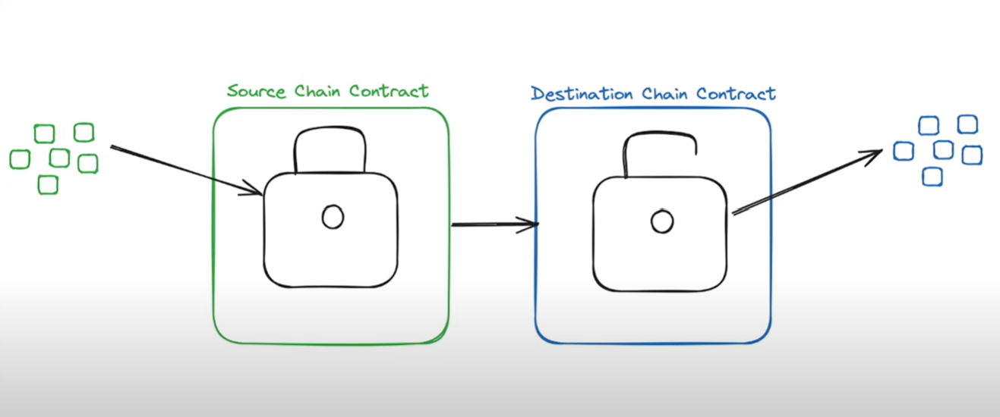
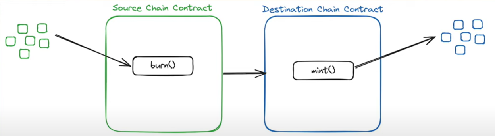
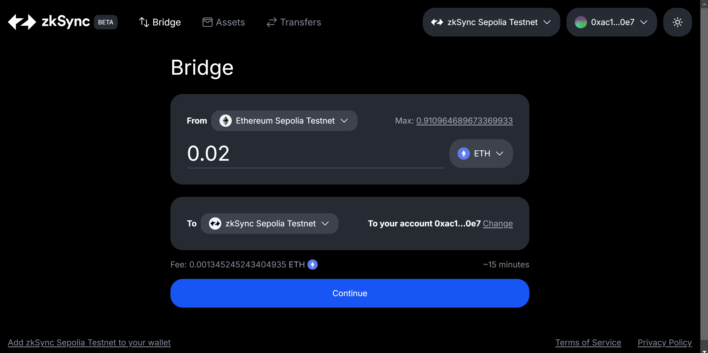
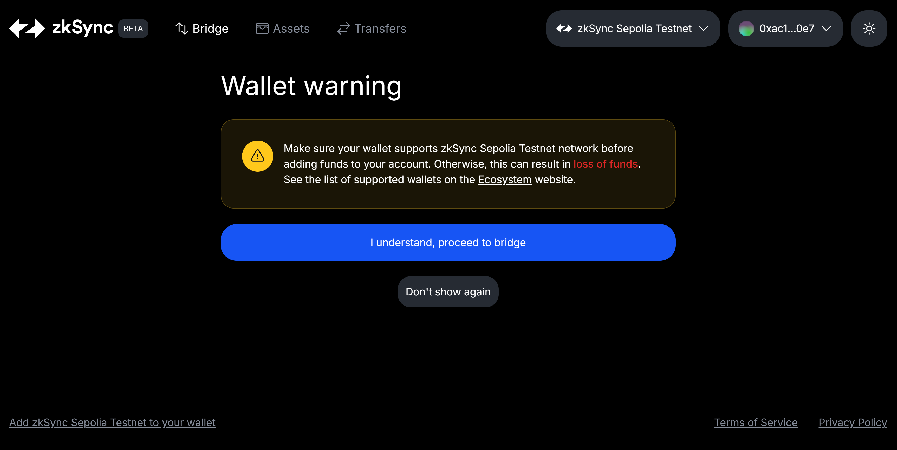
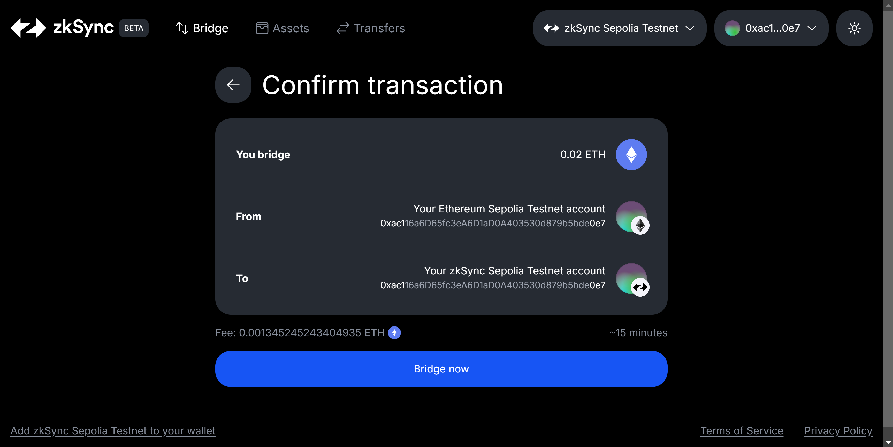
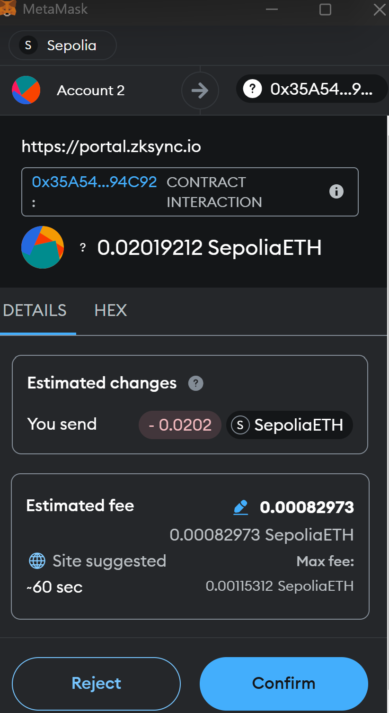
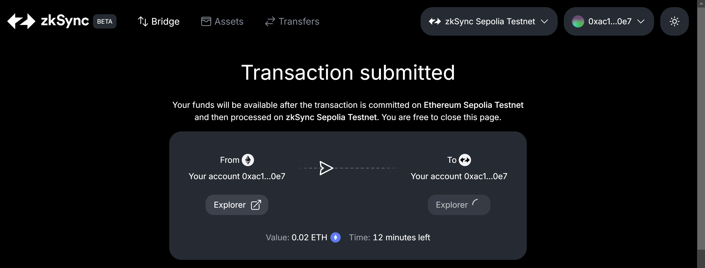
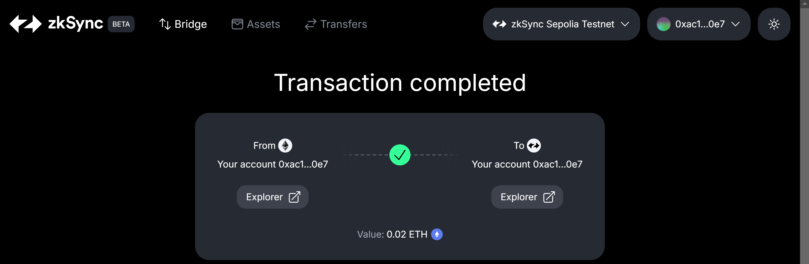
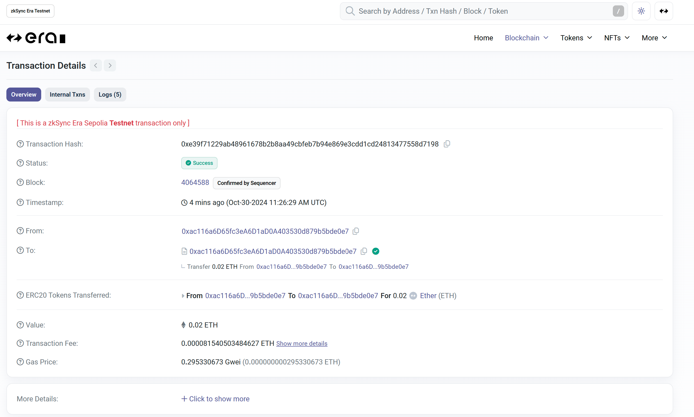
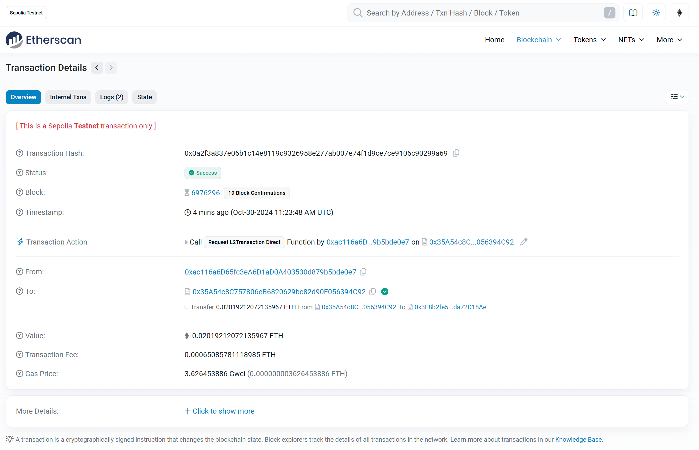

# Bridging Funds

Bridging funds in the blockchain context refers to the process of transferring assets between different blockchain networks or layers.

Blockchain bridges are essential infrastructure for the growing multi-chain crypto ecosystem. They enable users to leverage assets across different networks, access diverse DeFi opportunities, and contribute to the overall growth of the blockchain space. However, users should be aware of the potential risks and carefully evaluate the security measures of any bridge they intend to use.

## Types of Bridging

### Via Smart Contracts

### Via Process of Buring and Minting

Blockchain bridges play a crucial role in the crypto ecosystem by:

- Enhancing liquidity across different blockchain networks.
- Enabling users to access diverse DeFi applications and yield opportunities.
- Facilitating the transfer of assets and data between otherwise isolated blockchain ecosystems.
- Supporting the growth of multi-chain dApps and protocols.
- Improving overall scalability and efficiency of the blockchain ecosystem.

## Steps to Bridge Sepolia ETH to zkSync Sepolia ETH

- Use faucet(s) for the getting Sepolia ETH
  - [Google Faucet](https://cloud.google.com/application/web3/faucet/ethereum/sepolia)
  - [Chainlink Faucet](https://faucets.chain.link/)
- Go the to [zkSync Bridge](https://portal.zksync.io/bridge/)
  - Refer to [zkSync Documentation](https://docs.zksync.io/zk-stack/concepts/transaction-lifecycle) to understand the lifecycle of transactions
- Change the network to "zkSync Sepolia Testnet"
- Connect your Wallet
- Select "from" and "to" testnets, it will display the fee for the transfer
- Click "Continue"
- PFB, screenshots showing the next steps

[Transaction Details on zkSync Sepolia Explorer](https://sepolia-era.zksync.network/tx/0xe39f71229ab48961678b2b8aa49cbfeb7b94e869e3cdd1cd24813477558d7198)

[Transaction Details on Etherscan](https://sepolia.etherscan.io/tx/0x0a2f3a837e06b1c14e8119c9326958e277ab007e74f1d9ce7ce9106c90299a69)

