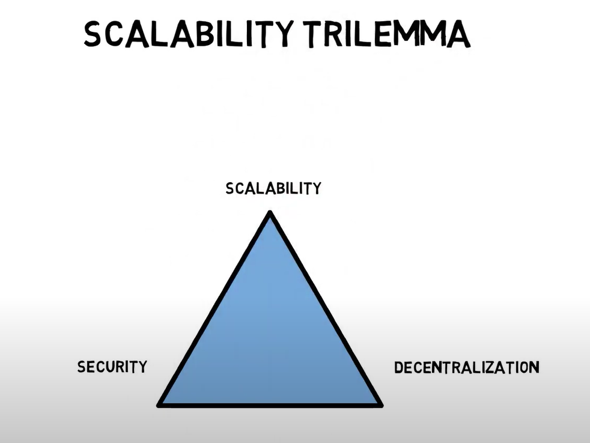

# Blockchain Basics

## Bitcoin

- First cryptocurrency which got the focus to the blockchain.
- It is often known as digital gold or store of value.

## Proof of Work (PoW) and Proof of Stake (PoS)

**Proof of Work (PoW)** is a consensus mechanism used by many cryptocurrencies, most notably Bitcoin, to validate transactions and add new blocks to the blockchain.

Miners compile recent transactions into blocks, then race to find a valid hash for the block that meets specific criteria (requires high computation power and energy); the first miner to find a valid hash gets to add the block to the blockchain and receives newly minted coins and transaction fees.

**Proof of Stake (PoS)** is a consensus mechanism used by many cryptocurrencies to validate transactions and add new blocks to the blockchain. Participants lock up a certain amount of cryptocurrency as their "stake" (this is called staking); the blockchain protocol chooses validators to verify transactions and create new blocks, often with an element of randomization; then selected validators verify transactions and add new blocks to the chain and receive cryptocurrency rewards for their work.

## Blockchain Platforms

Blockchain platforms are digital infrastructures that provide the foundation for developing and deploying blockchain-based applications and services. Examples of platforms:

- Ethereum
- Solana
- Cardano
- Polkadot
- Algorand
- R3 Corda
- Hyperledger Fabric

## Ethereum

- Kind of cryptocurrency BUT it is also a platform which takes the decentralized technology to the next level by providing platform to build and deploy smart contracts which are decentralized, automated, immutable, and trust minimized agreements.

Ethereum uses Keccak-256, which is a cryptographic hash function that is part of the Keccak family of hash functions. It has gained prominence due to its use in various cryptocurrencies, most notably Ethereum.

```solidity
bytes32 hash = keccak256(abi.encodePacked("Hello, World!"));
```

Ethereum Homepage: <https://ethereum.org/en/>

## Chainlink

Chainlink is a decentralized network which allows the smart contracts deployed on the blockchain to interact/get the off-chain decentralized data.

Chainlink documentation: <https://docs.chain.link/>
Chainlink Faucet(s): for getting test tokens to use on testnet

- <https://faucets.chain.link>
- <https://cloud.google.com/application/web3/faucet/ethereum/sepolia>

## Smart Contract

A smart contract is a self-executing computer program that runs on a blockchain network, automatically enforcing the terms of an agreement between parties when predefined conditions are met.

**Advantages**:

- Self executing
- Decentralized (without need of intermediaries)
- Transparent and publicly verifiable
- Immutable
- Efficient, fast, accurate
- Reduced overhead costs
- High level of security, as the data is encrypted and stored across a distributed network
- Counterparty risk removal

## Nonce

A nonce, short for "number used once" or "number once", is a random or semi-random number that plays a crucial role in blockchain mining and security.

## Blockchain Trilemma

The blockchain trilemma, coined by Ethereum co-founder Vitalik Buterin, refers to the challenge of achieving optimal levels of three critical aspects of blockchain technology simultaneously:

- Security
- Scalability
- Decentralization


The trilemma posits that it's extremely difficult, if not impossible, to achieve all three aspects simultaneously at optimal levels. Typically, improving one aspect comes at the expense of one or both of the others.
