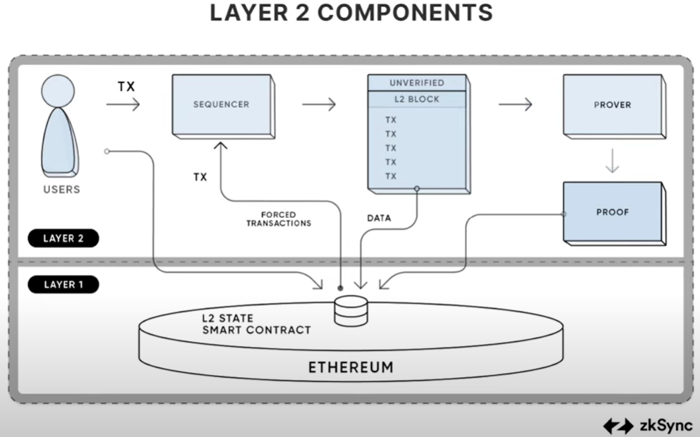

# Layer 1 and Layer 2 Blockchains

Layer 1 and Layer 2 blockchains work together to create a more scalable, efficient, and secure blockchain ecosystem. Understanding the differences and how they complement each other is crucial for blockchain development and innovation.

## Layer 1 Blockchains

Layer 1 blockchains refer to the **base layer** or the **main blockchain architecture**. Examples include Bitcoin, Ethereum, and Litecoin. These blockchains handle all on-chain transactions and provide the foundational security and consensus mechanisms.

### Key Features of Layer 1 Blockchains

- **Decentralization**: Ensures no single entity controls the network.
- **Security**: Provides robust security through consensus algorithms like Proof of Work (PoW) or Proof of Stake (PoS).
- **Scalability Challenges**: Often face issues with transaction speed and scalability.

## Layer 2 Blockchains

Layer 2 solutions are built on top of Layer 1 blockchains to enhance their scalability and efficiency. They handle transactions off-chain and then report back to the main chain, reducing congestion and improving transaction speeds.

**NOTE**:

- Applications deployed on L1 are not considered L2. L2 is built outside of L1 and then hooks back into L1.
- L2 can be classified into Rollups and Sidechains, however the term L2 is used in reference to rollups.

### Key Features of Layer 2 Blockchains

- **Scalability**: Significantly increases transaction throughput.
- **Lower Fees**: Reduces transaction costs by processing transactions off-chain.
- **Interoperability**: Can work across different Layer 1 blockchains.

### Examples

- **Chainlink**: Provide decentralized solution to fetch the offchain data. These are also known as Blockchain Oracles.
- **Arbritrum**: Multi round fraud proof mechanism that processes transactions off-chain and post transaction data to Ethereum mainnet.
- **Optimism**: Single round fraud proof mechanism that processes transactions off-chain and post transaction data to Ethereum mainnet.
- **Lightning Network**: A Layer 2 solution for Bitcoin that enables fast and low-cost transactions.
- **Plasma**: A framework for building scalable applications on Ethereum.

## Rollups

Rollups are Layer 2 scaling solutions for Ethereum designed to improve transaction speed and reduce costs. Rollups execute transactions off-chain, post transaction data on-chain (Ethereum mainnet), inherit security from Ethereum, and significantly increase throughput and reduce gas fees per transaction.

Rollups represent a promising solution for Ethereum's scaling challenges, offering a balance between efficiency and security while leveraging Ethereum's existing infrastructure and security model. There are two types of rollups:

- **Optimistic Rollups**
  - Assume transactions are valid by default
  - Use fraud proofs to challenge invalid transactions
  - *Examples*: Optimism, Arbitrum
  - Fully EVM compatible, longer finality time due to challenge period, and have lower computational requirements

- **Zero-knowledge (ZK) Rollups**
  - Use zero-knowledge proofs to validate transactions
  - Provide faster finality
  - *Examples*: zkSync, StarkNet, Loopring
  - Faster finality than Optimistic Rollups, but need higher computational requirements and are more complex to implement

### Benefits of Rollups

- Increased scalability (potentially thousands of TPS)
- Lower transaction fees
- Improved user experience
- Maintain Ethereum's security guarantees

### How Rollups Work?

- Transactions are executed off-chain
- Transaction data is compressed and posted to Ethereum
- The rollup contract on Ethereum verifies the data
- State transitions are finalized on Ethereum

#### Sequencer in Rollups

Sequencers play a crucial role in rollup architectures, acting as the entity responsible for processing and ordering transactions within the Layer 2 (L2) network. Sequencer is responsible for transaction collection, ordering, block production, and data submission to the L1 chain.

In most current rollup implementations, sequencers are centralized, meaning a single node performs these functions. This centralization helps:

- improve performance
- deliver faster transaction processing
- provides quicker pre-confirmations for users
- simplifies architecture and easier maintenance

However, it leads to:

- censorship or transaction reordering
- single point of failure affecting network liveness
- centralization risks contradicting blockchain principles

### Challeneges to be considered while using Rollups

- Potential centralization risks with rollup operators
- Complexity in implementation, especially for ZK-Rollups
- Withdrawal delays for Optimistic Rollups
- Data availability concerns

### Stages in Rollups

**Stage 0: Full Training Wheels**:

- Essential control is in the hands of operators
- Transactions are posted on-chain, allowing for withdrawals
- Data availability is provided on Layer 1
- Rollup node software is available to reconstruct the state
- May lack active fraud proof or validity proof mechanisms
- *Examples*: Optimism, zkSync Era, Polygon zkEVM (as of Oct 2024)

**Stage 1: Limited Training Wheels**:

- Functional proof system to verify transaction batch validity
- Somewhat decentralized fraud proof system (at least 5 external actors can submit proofs)
- Independent user exits allowed (users can withdraw without relying on operators)
- 7-day window for exits in case of significant upgrades
- Security Council with multisig setup (at least 8 participants, half external)
- *Examples*: Arbitrum, zkSync Lite (as of Oct 2024)

**Stage 2: No Training Wheels**:

- Permissionless fraud proofs (anyone can submit)
- Timelocked upgrades with at least a 30-day window for user exits
- Security Council with very limited power (only for significant flaws)
- Increased decentralization and trust in the system
- Community-driven governance through on-chain mechanisms
- Improved network sustainability

## Rollups vs Side-Chains

Rollups and sidechains are both scaling solutions designed to improve blockchain performance, but they operate in fundamentally different ways.

**Rollups** process transactions off-chain but post compressed transaction data back to the main chain, inheriting its security. This approach allows rollups to maintain a high level of security while significantly increasing transaction throughput and reducing fees.

**Sidechains**, on the other hand, operate as separate blockchains with their own consensus mechanisms and security models. They don't rely on the main chain for security and handle data availability independently, which can lead to faster finality and potentially higher transaction capacity.
