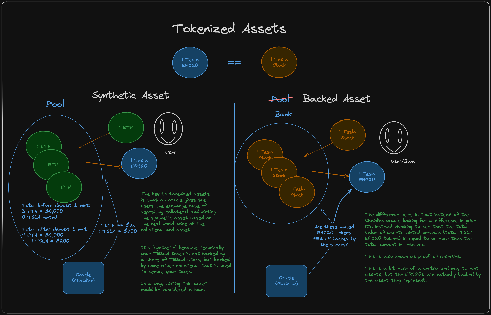
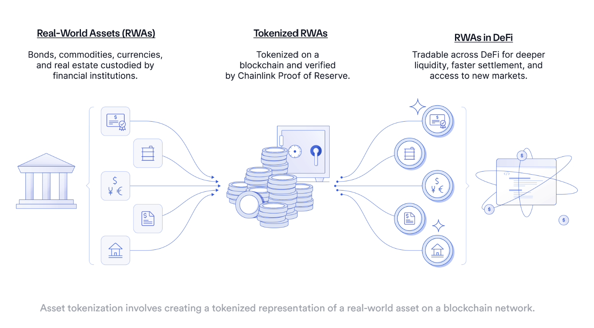

# Tokenizing Real World Assets (RWAs)

- **Asset tokenization** is an innovative process that involves representing ownership rights of real-world assets as digital tokens on a blockchain.
- **Asset tokenization** is a term for the use of smart contract and blockchain technology to represent ownership or rights to an asset as a tradable, onchain token.
- Most commonly refers to the tokenization of financial or fungible assets, such as shares in a company or a quantity of gold, asset tokenization can hypothetically refer to the tokenization of anything possessing monetary value.

Pattrick Collin's repository containing templates for tokenizing the real world assets: <https://github.com/PatrickAlphaC/rwa-creator>

## How does Asset Tokenization work?

By consolidating origination, distribution, trading, clearing, settlement, and safekeeping into a single layer, tokenization enables a streamlined and efficient financial system underpinned by blockchain technology.

### Steps Involved in Creating Tokens for Real World Assets

**Step 1**: Identify the real world asset that is to be tokenized. Example: Gold, currencies, real-estate, intellectual property, etc.

**Step 2**: Defining the token type - fungible token or non-fungible token? Based on that decide which token standard is to be used - ERC20, ERC721, etc.

**Step 3**: Choosing the Blockchain, i.e. token has to be issued on the public/private/permissioned blockchain. And decide whether rollup is to be utilized, etc.

**Step 4**: Verifying the Offchain Asset. Establish secure and reliable offchain connections using Chainlink services to enrich tokenized assets with essential data.

- This includes Chainlink Proof of Reserve to verify collateralization and Chainlink Price Feeds to ensure secure markets.
- As tokenized assets move across chains, *Chainlink Cross-Chain Interoperability Protocol* (CCIP) ensures that critical data such as price, NAV, and identity data remain synchronized and up-to-date across all blockchains, maintaining a Unified Golden Record and enabling seamless cross-chain interoperability.

**Step 5**: Enabling Secure Minting of the Tokens. We need to ensure that the newly minted tokens are fully backed by reserves.

## Benefits of Asset Tokenization

- **Increased efficiency**, since a blockchain’s ledger serves as the source of truth, enabling the ability to program complex rulesets directly into tokens.
- **Reduced costs**, as peer-to-peer transactions decrease reliance on intermediaries.
- **Enhanced transparency**, as the inherent auditability of blockchain technology can be leveraged.
- **Improved liquidity**, as on-chain markets can be created for historically illiquid markets.

## Hurdles in Asset Tokenization

- Legal Hurdle
- Anchoring the token price to the real world asset price

## Need for Oracles in Asset Tokenization

In order for something of monetary value to be accurately represented and traded on the blockchain, there must be good information on the asset.

This need is especially acute at four stages in a tokenized asset’s life cycle:

- when the tokens are created
- when they are used as collateral
- when users check their valuations
- when they are sold on secondary markets

### Cross-Chain Interoperability Protocol (CCIP)

Some tokenized assets need to be interoperable across different computing environments to access a broader pool of liquidity and a larger number of users across different platforms and ecosystems.

The Chainlink's Cross-Chain Interoperability Protocol (CCIP) eliminates the need for developers to write custom code for building chain-specific integrations and help make native cross-chain tokenized assets.
